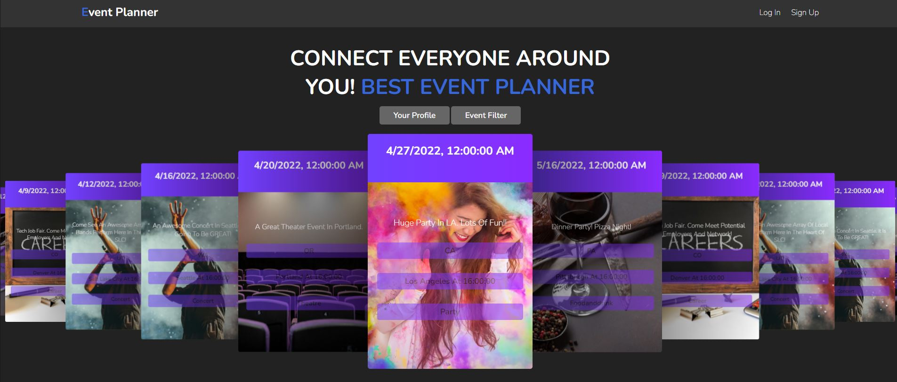

# Event Planner 

## Description 

Event Planner was designed with the partier in mind, the one who wants to find fine dinning or a friend to have a good time. Event Planner is the easiest way for anyone to find an event to attend, create or host your own event or browse what's happening in your local area.

This project was built for the UW Coding Boot Camp Group Project 2, UW Boot Camp. 

## Table of Contents
    
- [Installation](#installation)
- [Usage](#Usage)
- [Techniques](#Techniques)
- [License](#Licensing)
- [Team Members](#teammembers)
- [Future Development](#future)
- [Resources](#resources)

## Installation

No Installation required. Follow the Heroku link and start using.

## Usage

[Heroku Link](https://obscure-chamber-98928.herokuapp.com/)

 
## Techniques & Technologies

1. [Swiper](https://swiperjs.com/get-started) - Used as our CSS framework
2. [Express](https://www.npmjs.com/package/express)
3. [BCrypt](https://www.npmjs.com/package/bcrypt)
4. [Sequelize](https://www.npmjs.com/package/sequelize)
5. [MySQL2](https://www.npmjs.com/package/mysql2)
6. [Connect Session](https://www.npmjs.com/package/connect-session-sequelize)
7. [HandleBars](https://www.npmjs.com/package/express-handlebars)

## Licensing

[MIT License](https://github.com/git/git-scm.com/blob/main/MIT-LICENSE.txt)

    Permissions
        - Commercial use
        - Distribution
        - Modification
        - Private use

    Conditions
        - License and copyright notice

    Limitations
        - Liability
        - Warranty

## Team members:

1. Stone Comstock https://github.com/stone-com (Backend Functionality)
2. Namees Albayati https://github.com/namees-github (Backend Functionality)
3. Mike Sanders https://github.com/Mike-C-Sanders (Frontend Functionality)
4. Chengchien Huang https://github.com/Morganbb104 (Frontend Functionality)

## Expectation in the future:

1. Add in a google maps integration - where’s the party at!
2. Live chat functionality for when the event is taking place! 
3. Rate the event and rate the host

